# oracle

## 基础命令

##### 用户登录

```sql
sqlplus scott/tiger
```

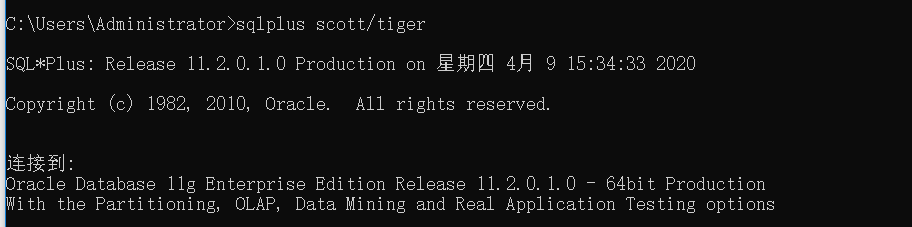

##### 创建表tb_shopType

```sql
create table tb_shopType(
	ID number(6) primary key,
	typeName varchar2(20) not null
);
```


##### 创建表tb_shop

```sql
create table tb_shop(
  	shopId number(10) primary key,
  	shopName varchar2(20) not null,
  	price number(6,2) not null,
  	shopTypeId number(6) not null, 
  	manufacturingDate date null, 
  	constraint ck_price check(price>0),
  	constraint fk_shopType foreign key(shopTypeId) references 		tb_shopType(id)
);

```

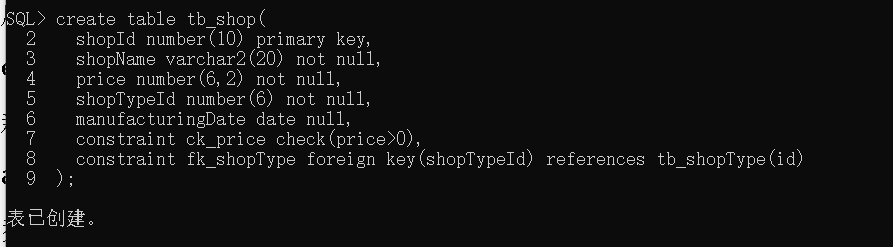

##### 向已经创建的表中添加新的列

```sql
alter table tb_shop add memo varchar2(100);
```

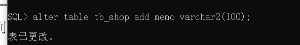

##### 查询指定表的信息

```sql
desc tb_shop;
```

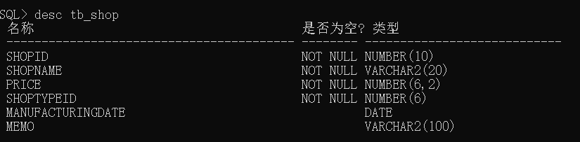

##### 修改表中指定的数据类型和类型长度

```sql
alter table tb_shop modify memo varchar2(50);
```


##### 删除表中的列

```sql
alter table tb_shop drop column memo;
```

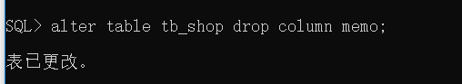

##### 给表添加约束（唯一约束）

```sql
alter table tb_shopType add constraint unqu_typename unique(typeName);
```

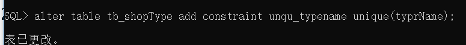

##### 修改表名

```sql
alter table tb_shop rename column memo to memeos;
```

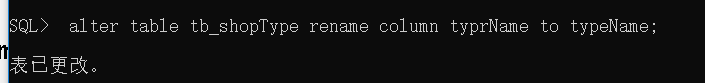

##### 创建序列 添加序列

```sql
 create sequence seq_test;
select seq_test.nextval from dual
```

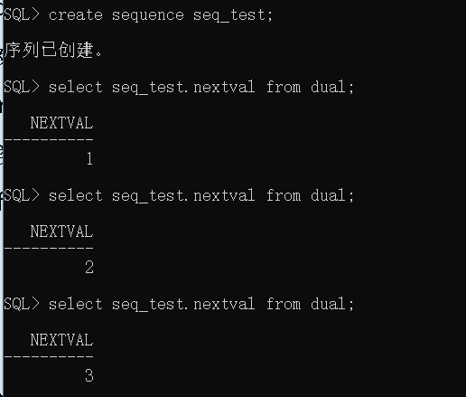

##### 返回序列生成的当前值

```sql
select seq_id.currval from dual
```

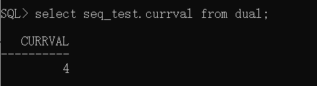

##### 添加序列

```sql
 insert into tb_shoptype values(seq_shoptype.nextval,'酒类');
```

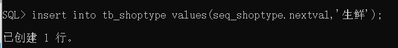

##### 删除序列

```sql
drop sequence seq_test;
```

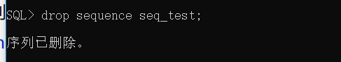

##### 切换管理员

```sql
conn system/root;

conn scott/tiger;
```

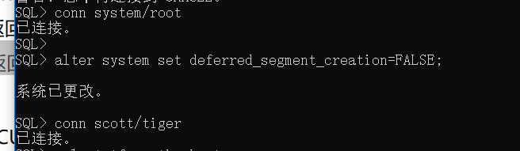

##### 解决序列不是从1

> 切换到管理员然后输入命令
>
> 1.关闭延迟创建特性，让序列可以从1开始添加

```sql
conn system/root;
alter system set deferred_segment_creation=FALSE;

```

> 2.在创建表时让seqment立即执行
>
> ```sql
> CREATE TABLE tbl_test(
>     test_id NUMBER PRIMARY KEY, 
>     test_name VARCHAR2(20)
> )
>  SEGMENT CREATION IMMEDIATE;
> ```
>
> 